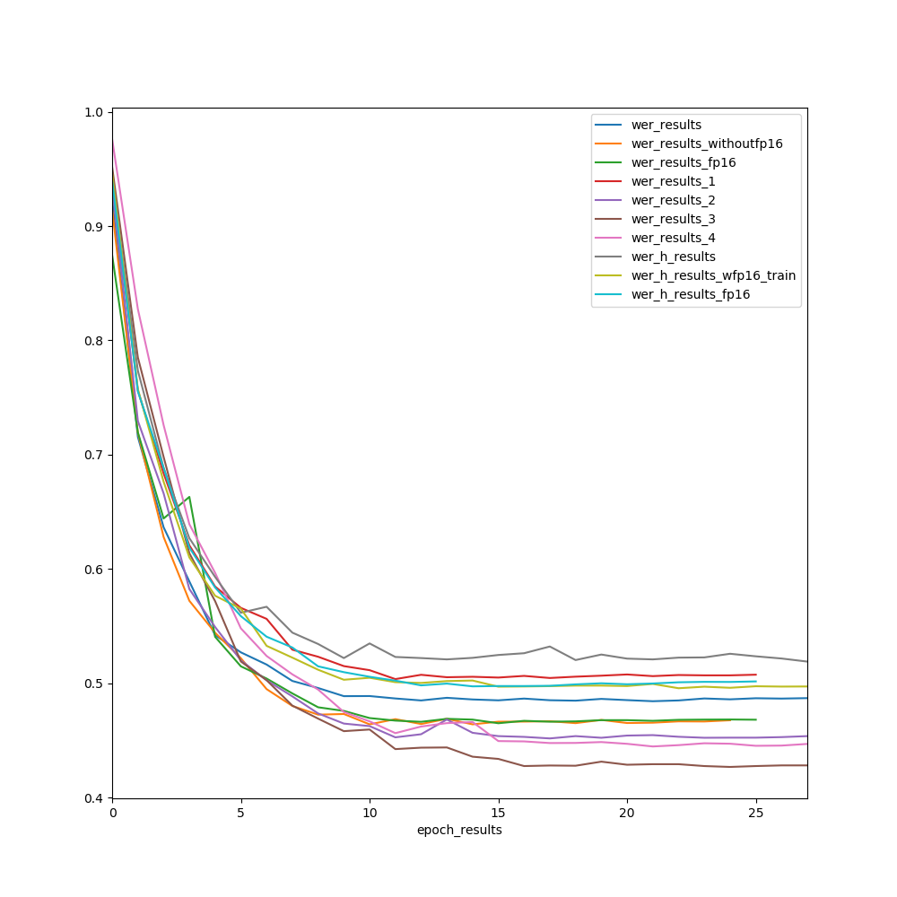
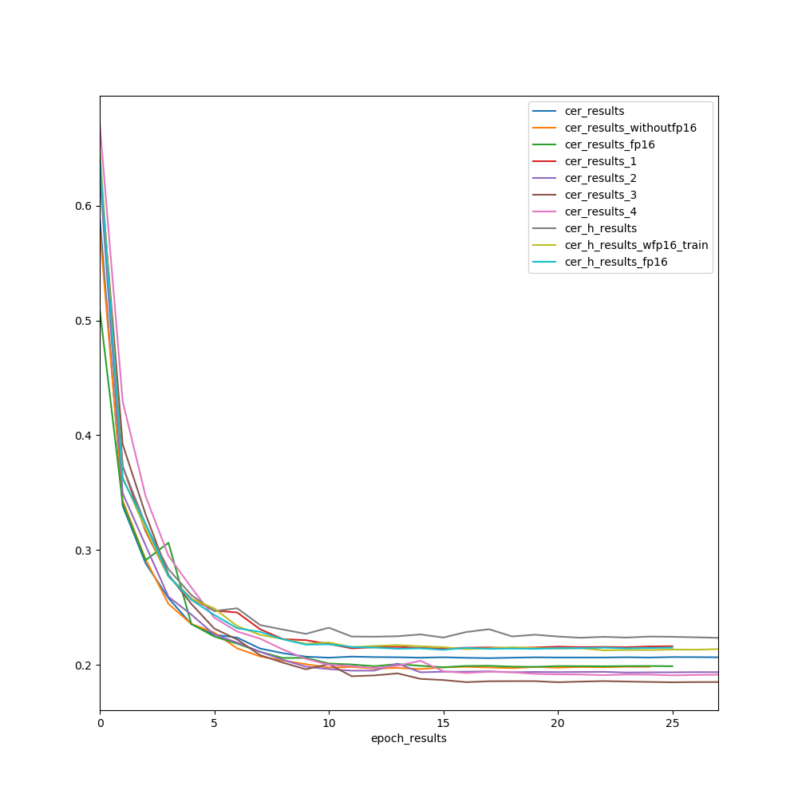

# Benchmarking
## Running Benchmarks

To run the benchmarks on your machine, run the following command-

`python summary_experiments.py --log-directory /path/to/training/log/directories --plot-directory /path/to/save/plots`

## Results

|          Experiment      |Total Epochs  |Mean Epoch Time (seconds)                         |Best WER    | Best CER
|----------------|-------------------------------|-----------------------------|------------|-
|train.py (RTX 2080)		 |`28`            |`1085.748652`                |`0.4844020`|`0.205757`
|train_fp16.py (**without** fp16) (RTX 2080)  |`25`            |`1096.411415`          |`0.4641825` |`0.1962075`
|train_fp16.py (**with** fp16)  (RTX 2080)        |`26`|`810.529019`|`0.465145`|`0.1978029`
|results_1          |`26`|`688.65123`|`0.503755`|`0.214121`
|results_2          |`34`|`447.3311`|`0.451858`|`0.193221`
|results_3          |`36`|`354.37731`|`0.42692`|`0.184720`
|results_4          |`36`|`285.4725`|`0.444829`|`0.190737`
|h_results		 |`38`            |`1017.10466`                |`0.51906`|`0.22344`
|h_results_wfp16_train   |`33`            |`1185.2506`          |`0.495763` |`0.212548`
|h_results_fp16         |`26`|`1581.36123`|`0.497400`|`0.213027`

## Plots

